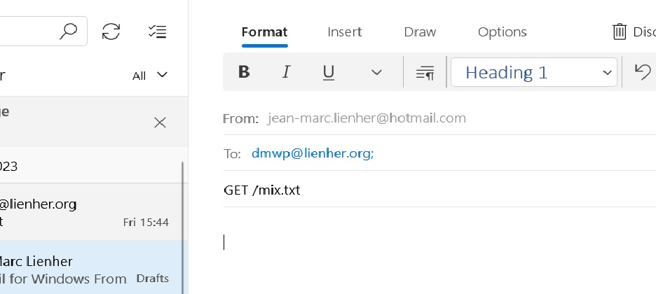

# dmwp

DeMilitarized Wire Protocol for Android

The Gradle files are Copyrighted by their authors.

Other source files are Public Domain.

## Description

``dmwp`` is an automatic e-mail responder.

It replies to subjects begining with "GET /" or "PUT /"

## USAGE

Setup your IMAP and SMTP account in the ``Settings`` page.

Select ``start service`` and let run the application in the background.

